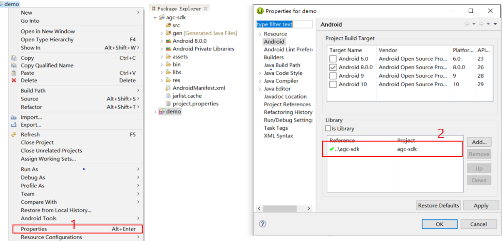

# aar-to-eclipse
1、aar-to-eclipse是通过gradle插件的方式，将aar（maven） 转化成 eclipse工程

2、本工程基于https://github.com/kezong/fat-aar-android改写而成

3、本工程的用法

> 目的：由于eclispe不支持集成ar，并且也不支持将aar在maven上依赖的组件都下载到本地；本指导和工具可以方便开发者将maven上的aar库（支持依赖传递）转成Eclipse工程，方便集成到开发者自己的Eclipse开发环境中。
>
> 以下以AppGallery Connect SDK Kit的auth组件(com.huawei.agconnect:agconnect-crash:1.2.1.300)为例

## 操作步骤

1. 确认本地已经搭建好JAVA环境和Android SDK环境

   在命令行中敲击如下命令，会有对应的返回

   ```cmd
   >echo %JAVA_HOME%
   C:\Program Files\Java\jdk1.8.0_191
   >java -version
   java version "1.8.0_191"
   >echo %ANDROID_HOME%
   D:\app\Android\sdk
   ```

2. 下载并解压aar2eclipse.zip[https://github.com/netwalker128/aar-to-eclipse/releases/download/v1.0/aar2eclipse.zip]，得到文件夹

   ```cmd
   D:\temp\aar2eclipse>dir
   
   2020/03/02  19:44    <DIR>          .
   2020/03/02  19:44    <DIR>          ..
   2020/03/02  19:33    <DIR>          aar
   2020/03/02  19:42    <DIR>          repo
   ```

   

3. 检查maven仓的地址：

   打开aar根目录下build.gradle文件，如果是从huawei的maven下载对应组件，此处不需要修改

   ```groovy
   allprojects {
       repositories {
           maven { url 'https://developer.huawei.com/repo' }
           google()
           jcenter()
       }
   }
   ```

4. 填入需要合并的maven库组件信息：

   修改aar/build.gradle文件，示例中是下载agconnect-crash组件的1.2.1.300版本

   **注意：**只需要填入最顶层的信息即可，会自动将传递依赖包都下载合并

   ```groovy
   dependencies {
       //填入需要集成的maven仓里的goup:artifact:version
       transform "com.huawei.agconnect:agconnect-auth:1.2.1.300"
   }
   ```

5. 执行转换AAR为eclipse工程：

   打开aar2eclipse根目录下build.bat文件，执行成功后，会在日志中打印输出的eclipse工程文件夹路径（即根目录下的eclipse文件夹）

   ```cmd
   [fat-aar]============out dir============: D:\temp\aar2eclipse\aar\eclipse
   
   D:\temp\aar2eclipse\aar\eclipse>dir
   2019/09/20  15:03    <DIR>          .
   2019/09/20  15:03    <DIR>          ..
   2019/09/20  15:03             1,198 AndroidManifest.xml
   2019/09/20  15:03    <DIR>          assets
   2019/09/20  15:03    <DIR>          libs
   2019/09/20  15:03                64 project.properties
   2019/09/20  15:03    <DIR>          res
   ```

6. eclipse的工程文件已经转换好了，开发者可以将其作为Android Library引用到自己的工程中

   

## 注意事项

1. **assets目录**：由于eclipse不能自动合并assets目录，请手动将assets文件夹里的文件拷贝到app工程的assets里

2. **${applicationId}：**由于eclipse不支持$符号，请手动修改AndroidManifest.xml中的${applicationId}为apk自己的packagename，例如：

   ```xml
   <!--修改前-->
   <provider
       android:name="com.huawei.agconnect.core.provider.AGConnectInitializeProvider"
       android:authorities="${applicationId}.AGCInitializeProvider"
       android:exported="false" />
   
   <!--修改后-->
   <provider
       android:name="com.huawei.agconnect.core.provider.AGConnectInitializeProvider"
       android:authorities="com.lucky.agc.demo.AGCInitializeProvider"
       android:exported="false" />
   ```

3. 加载JSON代码：

   ```java
   public class MainApplication extends Application {
       @Override
       protected void attachBaseContext(Context context) {
           super.attachBaseContext(context);
           AGConnectServicesConfig config = AGConnectServicesConfig.fromContext(context);
           config.overlayWith(new LazyInputStream(context){
               public InputStream get(Context context) {
                   try {
                       return context.getAssets().open("agconnect-services.json");
                   } catch (IOException e) {
                       return null;
                   }
               }
           });
       }
   }
   ```

4. **manifest：**由于eclipse默认不支持AndroidManifest.xml文件的合并，需要在app工程的project.properties中增加一个配置项

   ```properties
   manifestmerger.enabled=true
   ```

   

感谢：

https://github.com/kezong/fat-aar-android

